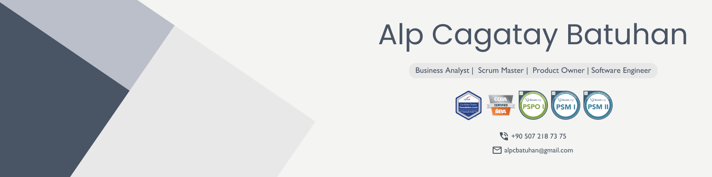

# 💫 About Me:
👋 Hi there!   🔭 I’m a software engineer with a passion for learning and a curiosity for understanding the processes behind software development.  🤝 In the past, I have focused my studies on Docker and Python 🌱 I’m currently working as a business analyst to gain a deeper understanding of the challenges and opportunities that arise when developing software within an organization.  ✌️ I hold CTFL, CCBA, PSPO I, and PSM I certifications, which have equipped me with testing and business analysis best practices, as well as an Agile mindset and a strong understanding of Scrum.   I'm a huge fan of Beşiktaş   On this GitHub profile, you will find some of my personal projects and contributions to open source software. I am always looking for opportunities to collaborate on new projects and learn from other developers, so feel free to reach out and connect!

## 🌐 Socials:
 

# 💻 Tech Stack:
                    	        
